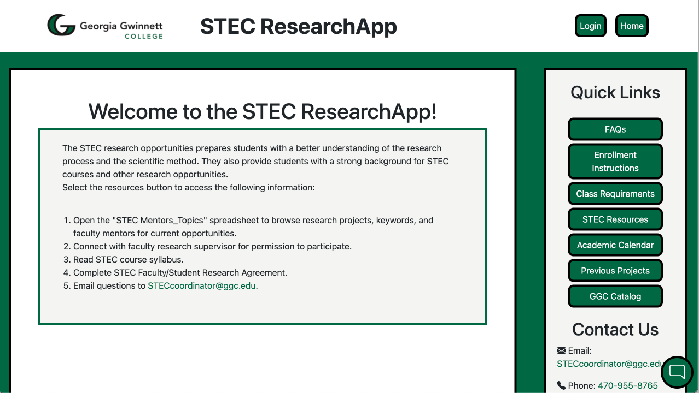
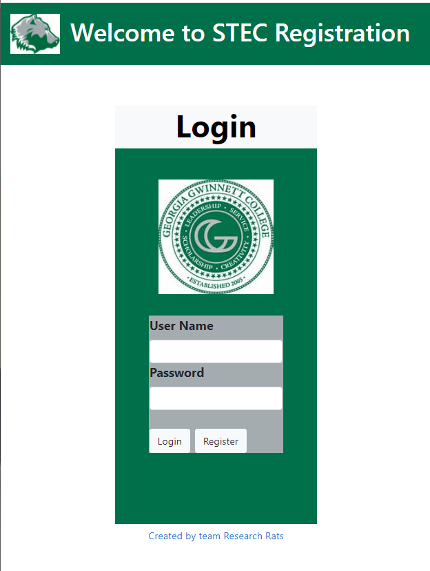

# **STEC ResearchApp**

### **Application hosted on Netlfiy: Link**

## **Fall 2022 Team: Wired Wires "Experts"**

 

**Jeancarlo Masciotti** :alien:
  - Programmer
  - UX/UI Design
  - Team Manager

**Miranda Darlington** ✪ ω ✪
  - Programmer
  - UX/UI Design
  - Testing Lead

**Andres Almaraz** :taco:
  - Programmer
  - Data modeler
  - Client liaison

**Jafet Leon-Perez** :snake:
  - Programmer
  - Code Architecture/Lead Programmer
  - Documentation Lead

 

## **Description/About**

For our Software Development II project, we have chosen to work on the Research App web application. Its main purpose is to help students in finding a research project of their liking and sign up for them using online forms. These projects can be created and edited by GGC faculty and the STEC coordinator. Both can also view, search, and filter out submitted/in progress forms with the coordinator having more control in the app like having access to all forms and the ability to accept, deny, and delete any form.

**<a href="docs-Fall2022/License.md">Link to License</a>**  
**<a href="https://www.youtube.com/watch?v=Z97aJVH2VHI">Link to Demo</a>**  
**<a href="docs-Fall2022/ResearchApp.png">Link to CREATE Flyer</a>**

 

## **Technologies/Tools**

 

[Repository Location](https://github.com/jegioma/STEC_ResearchApp) :computer:

[Progress Tracking Tool](https://www.atlassian.com/software/jira) :bookmark_tabs:

[Communication Tool](https://discord.com/) :speech_balloon:

 

### <a href="https://angular.io/guide/setup-local">**Angular**</a> Installation/How to Run

1. Must have Node.js and npm package manager installed first. (npm comes with Node.js)
2. Install Angular CLI using `npm install -g @angular/cli`
3. Some Windows systems required PowerShell scripts to be enabled, use `Set-ExecutionPolicy -Scope CurrentUser -ExecutionPolicy RemoteSigned`
4. Create workspace by using `ng new my-app`
5. Run the application by using `cd my-app` then `ng serve --open` to view it on your local host
6. You have now created and viewed your first Angular workspace, congrats!

---

### <a href="http://expressjs.com/en/starter/installing.html">**Express.JS**</a> Installation/How to Run

1. Must have Node.js installed along with npm package manager
2. Create working directory using `$ mkdir myapp` and `$ cd myapp`
3. Create package.json file in your application by using `$ npm init`
4. Select default options when presented except `entry point: (index.js)`
5. Install Express in your app by using `$ npm install express`

---

### <a href="https://firebase.google.com">**Firebase**</a> Installation/How to Run

1. Sign in using a Google account for free
2. Click Get Started and then Add Project
3. Name and create project
4. Go to project settings and in general
5. Scroll down to your apps and click on the ' ' icon
6. Add app nickname and copy and paste npm script

OR install into workspace by using `$ npm install firebase`

---

### <a href="https://nodejs.org/en/download">**Node.JS**</a> Installation/How to Run

1. Head to the website and download the appropriate files for your system
2. Run Node.js.msi installer and accept license and privileges
3. Run `node -v` to ensure you have the latest version

---

### <a href="https://code.visualstudio.com/Download">**Visual Studio Code**</a> Installation/How to Run

1. Download correct version for your system
2. Run the .exe installer
3. Once downloaded you may begin using VSCode

## **List of Working Features**

- Creation of user accounts -
  Student users will be able to create accounts with usernames, passwords, and other unique data.
- Login/logout of accounts created - 
  Once a user is logged in, they have the ability to log out through a single button.
- Students are able to fill out and send forms - 
  Signed in students are able to view all 3 forms and fill out data and send it to the database.
- Admin able to view incoming forms - 
  Admin is able to pull up forms from the database.
- Quick link to other GGC websites - 
  Links in the landing page and footer direct the user to the correct GGC external site.

  

## **Main Page**

  

<h1>STEC4500-ResearchApp</h1>
<h5>The Research App was created to streamline the process of assisting students, faculty, and the STEC Coordinator with applying for the STEC-4500 Undergrad Research Project class. </h5>

http://researchapp.netlify.app
--

**Fall 2021 Team :Research Rats**

  

  
1.  Terrance
	1.  Programmer
	2.  Data modeler
	3.  Team Manager/Client Liason
	
2.  **Ching** :grin:
	1.  *Programmer* :beginner:
	2.  *UI/UX design* :beginner:
	3.  *Documentation Lead* :beginner:
	
3.  **Kris**  :stuck_out_tongue_winking_eye:
	1.  *Programmer* :beginner:
	2.  *Code architecture/lead programmer* :beginner:
	3.  *Testing Lead* :beginner:

<https://github.com/GGC-SD/STEC4500-ResearchApp.git>
  

**Technologies Used**

             

**Working Features**
1. Login using Firebase(BaaS) to Authenticate Users
2. Form data is being collected as a form object
3. A backend is built with MongoDB and Node.js found in the backend folder

**Features To Be Implemented**
1. The backend needs to be deployed and connected to the web app or another solution found to save form data
2. An Admin dashboard needs to be created that would allow the STEC Coordinator to:
   * Add/Delete/Edit forms
   * Search for completed forms
   * Notify when a form is submitted
3. Form validation needs to be added to the forms to control user data entry
4. Form validation needs to be added to the registration component
5. A password reset component should be added
6. A component for students and faculty to search and edit forms
